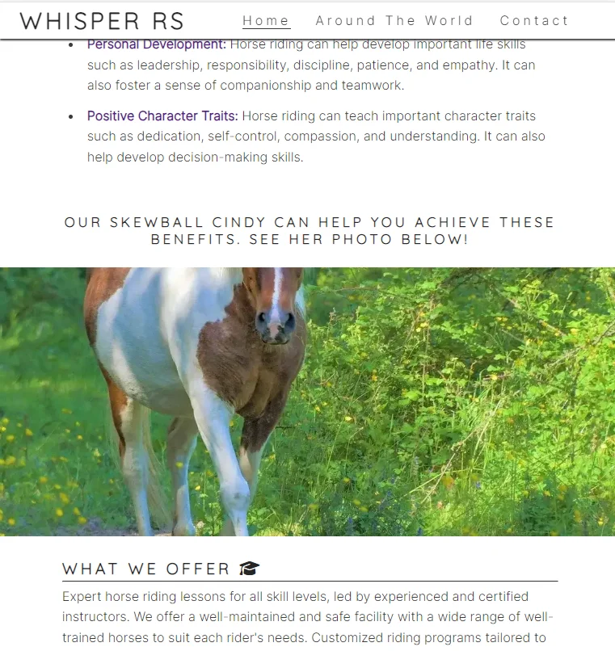

# Whisper Riding School

(Developer: Katie Dunne)

## Live website

Link to live website: [Whisper Riding School](https://ksdunne.github.io/whisper_riding_school/)

## Purpose of the project

Whisper Riding School is a fictitious business. Here is a 3-page, responsive website, built using only HTML and CSS for that business. This website is aimed at people that are interested in trying horse riding as a hobby, in the Leinster area of Ireland. The owner of 'Whisper Riding School' seeks to provide value to these people via horse riding education and in turn convert these interested people into customers of 'Whisper Riding School'. This website provides the user with a history about the farm, information about the benefits of horse riding, provides education on horse riding disciplines from around the world and encourages the user to use a contact form to get further information on lessons, safe riding gear, boarding and livery.

## Table of contents

  * [User experience (UX)](#user-experience-ux)
  * [User stories](#user-stories)
  * [Features](#features)
  * [Future features](#future-features)
  * [Design](#design)
  * [Wireframes](#wireframes)
  * [Technology](#technology)
  * [Testing](#testing)
  * [Deployment](#deployment)
  * [Credits](#credits)
  * [Acknowledgements](#acknowledgements)

## User experience (UX)

### Key project goals

-	Increase awareness of our business, Whisper Riding School, through a feel-good and accessible website with history about our farm and attractive images
-	Increase awareness of the services we offer, such as on-site lessons, education on disciplines from around the world, advice on gear if you contact us, boarding and livery
-	Build a website that encourages and directs the site user to contact us through the use of a form or to connect with us on our social media platforms, which will in turn convert the site user to a customer

### Target audience

- Adult customers that are new to horse riding that would like to explore the benefits of physical exericise paired with a connection to animals
- Parents of children that would like to explore horse riding as a new hobby
- Experienced riders that would like to book lessons
- People that would like to use the educational aspect of the site to widen their knowledge about riding disciplines from around the world
- Perspective lesson customers that would like to know what gear to bring with them, that is safe and functional? As this is a FAQ in horse riding
- People that would like to know the location of the farm so they can plan their trip to see us

### User requirements and expectations

- A visually appealing and intuitively structured website that works well and is easy to read on all screen sizes
- An intuitive navigation system wheather using a mobile, tablet or monitor
- Ability to quickly find relevant information on the business and its services
- Easy ways to contact the business and find our physical site using a map
- An ability to learn about horse riding disciplines from around the world
- Access to a contact form
- An accessible website for all users
- A website that loads quickly on all devices and connections

## User stories

- As a site visitor, I want to understand the purpose of this website and to easily navigate through it
- As a site visitor, I want to be able to see the name of the business and their main offering as soon as I land on the home page
- As a site visitor, I want to learn a bit about the history of the farm
- As a site visitor, I want to see the benefits of horse riding, so I can tell whether I would like to do it or not
- As a site visitor, I want to be able to see the location of the farm so that I can plan my visit e.g. a map
- As a site visitor, I want to find out ways to contact or connect with the business, e.g. a contact form and social media links
- As a site visitor, I want to contact Whisper Riding School to book a lesson
- As a site visitor, I want to be able to learn about safe riding gear that I should bring with me to my lesson
- As a site visitor, I want to broden my knowlegde of horse riding disciplines from around the world

## Features

### Logo and Navigation bar

A responsive navigation bar is in place. Concentrating on 'mobile first' design, the navigation bar incorporates a clickable burger icon with a drop down menu on mobile. When moving to tablet and monitor size the burger disappears and a traditional navigation bar appears with options to navigate to pages; 'Home', 'Around the World' or 'Contact'. There is a clickable horse logo for monitor sizes. This design benefits the user as it is intuitive and a common nav bar design. It is inviting to use, because it is easy to navigate.

#### Mobile navigation bar with burger menu

#### Monitor navigation bar with clickable horse logo

### Hero Image

The hero image on the index page was chosen to convey the exact purpose of Whisper Riding School. It is a colorful image of a girl jumping a fence on horseback in a sand arena. This is a typical activity you would find at a riding school in Ireland. Therefore, the user can see what typically happens at our farm.

#### Mobile hero image on home page

#### Monitor hero image on home page

### Cover text and tagline

The responsive cover text over the hero image states the name of the business and the tagline conveys that we offer lessons. Lessons are what the site user is most likely looking for when they visit this website.

#### Covertext on mobile

#### Covertext on monitor

### About

Gives a romantic history of the farm to add to the 'feel-good' emotion of the website.

#### About screenshot

### Benefits of Horse Riding

Allows the site user to understand the benefits that go along with physical exercise and connection to an animal. The user might choose to take horse riding up as a hobby after reading these benefits. The titles of each benfit are links to pages that explain the benefits more.

#### Benefits screenshot

### A fixed background image

The fixed background image is of a pony called cindy. This is a nice visual that is fun to scroll on a monitor to break up the large about of text that is on the index page. It is not a fixed background image on mobile.

#### Skewball image on mobile

#### A fixed background image on tablet and monitor

 See below the following 2 screen shots of how it looks when you scroll.

### What We Offer?

States the four main services that Whisper Riding School offer through the website and the business. These are; 1. 'lessons', 2. 'education' of diverse horse riding disciplines, 3. 'advice on gear' and 4. 'boarding and livery'.

#### Responsive what we offer panels on mobile

#### Responsive what we offer panels on a monitor

### Around the World

'Around the World' is the second page of this website and it offers the user 4 educational snippets. The user can learn about riding disciplines from around the world. Photos of dressage, polo, horse ball and western riding can be seen here with short explainations of each. There is a video near the bottom of this page that shows a western tack up routine. There is a 'call to action' to view the video in the text and the video provides interaction for the site user.

#### Around the world hero image on mobile

#### Education text

Gives the user a snippet of information on each discipline and a link to the wikipedia page about each, so that they can learn more if they would like.

#### Education image

The education images are visuals carefully chosen to represent each discipline.

#### Education video

The video is of a western tack-up routine. This is a different routine to the one used in English riding, therefore it is educational for someone that has never seen this alternative way of getting a horse ready for riding before.

### Contact Page

The hero image on the contact page shows a person kissing a horse on the nose because this is a 'feel-good' photo. The contact page has responsive panels with a contact form and an embedded map showing where our farm is located. The form has 4 input boxes, 3 radio buttons and a submit button. Two of the fields are required. The required fields are 'Full Name' and 'Phone'. Optional fields are email and a message. There is placeholder text in each field of the form to promt the user. The user can use the radio buttons to tell us if they would like to talk about lessons, gear or livery.

#### Contact hero image screenshot

#### Responsive contact panels contain a form and map inline on a monitor, but under each other on a mobile screen

### Contact Form

Offers the user the ability to contact Whisper Riding School and flag whether they want advice on lessons, gear or livery.

### Map

The Google maps feature is embedded in an iframe and this provides the site user the ability to plan their trip to the farm. It is responsive and is different sizes depending on the screen size the user has.

#### Responsive google map

### Footer

Which displays a clickable business logo, social media links, a copyright and a link to my github, because this is a portfolio website for a ficticious business. The footer is fully responsive depending on the size of the screen one is using.

#### Responsive footer screenshot on mobile

#### Responsive footer screenshot on monitor

## Future features

- Live weather forcast. This is a feature on some similar websites that I saw when doing research for this project. I saw a div with a widget that contains live data
- A page dedicated to gear. This is another popular page on horse riding websites
- A whisper riding school themed 404 page
- A whisper riding school themed confirmation page, once the form has been submitted. The code institute template one is in place at the moment
- A masonry photo gallery
- A checkbox to sign-up for a newsletter
- Contact details in the footer e.g. farm address and phone number
- More internal links to make navigation around the site very easy

## Design

### Design Choices

I was very loosely inspired by the colors, layout, services and features of the [Carrickmines Equestrian Center](https://www.carrickminesequestrian.ie/) website. This arose from my research of other horse riding school websites. I wanted to find one with intuitive layout and navigation that fit my desired content and that was also responsive.

The hero image for Whisper Riding School was chosen to convey the exact main service of the business. It is both eye-catching and informational.

### Typography

Google Fonts were used to import Inter and Quicksand fonts into styles.css. A generic sans-serif font was chosen as a back-up font. These were chosen as they are easy to read and are common to modern website design.

### Color

Since this business offers outdoor services such as horse riding lessons I chose earthy colors. I also kept accessibility in mind when choosing colors and I used a color blind friendly palette for inspiration. Colors were adapted from palettes generated using [Venngage's accessible color palette generator](https://venngage.com/tools/accessible-color-palette-generator).

Primary Colors - White / Green

Secondary Colors - Orange / Mustard / Blue / Off-White

- #c9ac3b, a mustard color that can be see in palette shown
- #88a542, a green that can be see in palette shown
- #5b9c69, a green that can be see in palette shown
- #359672, a green that can be see in palette shown
- #38989c, a bluish color that can be see in palette shown
- #CC864A, an orange inspired by the palette below
- #fffae6, off-white

## Wireframes

The overall structure was kept from inception of wireframes to final result of the website, however there are small discrepancies where the project evolved e.g. address can be seen in the footer of the wireframes, but in the final project this went into the contact page. This was because it visually looked better on the contact page and it is easy for the user to find on the contact page. Also, where you see 'contact us' in the nav bar of the wireframes, this ended up being simply 'contact' on the final version of the website, because it looked better and added a better flow to the website.

### Index Page Wireframes

### Around The World Page Wireframes

### Contact Page Wireframes

## Technology

### Languages

- HTML
- CSS

### Frameworks & Tools

- [Git](https://git-scm.com/)
- [GitHub](https://github.com/)
- [Code Anywhere Cloud IDE](https://app.codeanywhere.com/)
- [Balsamiq](https://balsamiq.com/wireframes/)
- [Favicon](https://favicon.io/favicon-generator/#google_vignette)
- [Venngage's Accessible color palette generator](https://venngage.com/tools/accessible-color-palette-generator)
- [Google Fonts](https://fonts.google.com/)
- [Font Awesome](https://fontawesome.com/)
- [W3C Markup Validation Service](https://validator.w3.org/)
- [W3C CSS Validation Service](https://jigsaw.w3.org/css-validator/)
- [Google Lighthouse](https://chrome.google.com/webstore/detail/lighthouse/blipmdconlkpinefehnmjammfjpmpbjk)
- [Chrome DevTools](https://developer.chrome.com/docs/devtools/)
- [Google Maps](https://www.google.com/maps)
- [YouTube](https://www.youtube.com/)
- [ChatGPT](https://chat.openai.com/) Note: AI was used for text content inspiration, not code.
- [Perplexity AI](https://www.perplexity.ai/) Note: AI was used for text content inspiration, not code.

The queries used for the educational sections of the website on chat gpt and perplexity.ai were as follows:

"Write 4 lines about dressage / horse polo / horse ball / western riding in an educational tone"

Text generated was heavily edited by developer.

## Testing

### Code validation

#### HTML validation

- No errors were returned on the index page when using the official W3C validator. See [Index Page Test](https://validator.w3.org/nu/?doc=https%3A%2F%2Fksdunne.github.io%2Fwhisper_riding_school%2Findex.html)

- No errors were returned on the around the world page when using the official W3C validator. See [Around The World Page Test](https://validator.w3.org/nu/?doc=https%3A%2F%2Fksdunne.github.io%2Fwhisper_riding_school%2Faroundtheworld.html)

- No errors were returned on the contact page when using the official W3C validator. See [Contact Page Test](https://validator.w3.org/nu/?doc=https%3A%2F%2Fksdunne.github.io%2Fwhisper_riding_school%2Fcontact.html)

#### CSS validation

- No errors were returned when using Jigsaw CSS validator. See [CSS Test](https://jigsaw.w3.org/css-validator/validator?uri=https%3A%2F%2Fksdunne.github.io%2Fwhisper_riding_school%2Fassets%2Fcss%2Fstyle.css&profile=css3svg&usermedium=all&warning=1&vextwarning=&lang=en)

### Accessibility and Lighthouse

- A score of 100 was reached for accessibility, best practices and SEO for the index page

- A score of 100 was reached for accessibility, best practices and SEO for the around the world page

- A score of 100 was reached for accessibility, best practices and SEO for the contact page

- After reading the source below, it is my opinion that, the 'performance' parameter in lighthouse could have been improved by using high fetch priority on the largest image. I will keep this in mind going forward with future projects.

[Optimize Largest Contentful Paint](https://web.dev/optimize-lcp/)

### Manual testing

#### Responsiveness of features tested using Chrome DevTools

 - All features were tested for the intended look and responsiveness using Chrome DevTools on iPhone SE, 375px wide, iPad Mini, 768px wide and Nest Hub Max,1280px wide

 - I also consistently tested the look and responsiveness down to 300px throughout development

 - All features passed responsiveness testing and looked good on all mentioned devices

 - See responsive feature testing results in the screenshot below

 - Most importantly the 'what we offer' box section, the video, the contact form and the map are all fully responsive

 - I have confirmed that the form works on the contact page. It requires some entries, it will only accept an email in the email box and the submit button works as intended

| responsiveness              | index | around the world | contact |
| --------------------------- | ----- | ---------------- | ------- |
| nav bar                     | pass  | pass             | pass    |
| hero image                  | pass  | pass             | pass    |
| covertext                   | pass  | pass             | pass    |
| tagline                     | pass  | na               | na      |
| about                       | pass  | na               | na      |
| benefits                    | pass  | na               | na      |
| fixed background image      | pass  | na               | na      |
| what we offer section       | pass  | na               | na      |
| around the world paragraphs | na    | pass             | na      |
| video                       | na    | pass             | na      |
| contact panel               | na    | na               | pass    |
| contact form                | na    | na               | pass    |
| map                         | na    | na               | pass    |
| footer                      | pass  | pass             | pass    |

#### Browser compatibility testing

 - All pages were tested for responsiveness on the following browsers, Chrome, Edge, Firefox, Safari and Opera

 - All 3 pages passed for responsiveness on each browser. The pages have the intended look on each browser

 - See browser compatibility testing results in the table below

| browser compatibility   | chrome | edge | firefox | safari | opera |
| ----------------------- | ------ | ---- | ------- | ------ | ----- |
| intended appearance     | pass   | pass | pass    | pass   | pass  |
| intended responsiveness | pass   | pass | pass    | pass   | pass  |

#### Testing all links on the site

|    | Clickable link                 | What does it do?                       | Does it work as expected? |
| -- | ------------------------------ | -------------------------------------- | ------------------------- |
| 1  | horse logo in header           | always returns to home page            | as expected               |
| 2  | horse logo in footer           | always returns to home page            | as expected               |
| 3  | clickable title 'whisper rs'   | always returns to home page            | as expected               |
| 4  | nav bar                        | drop down on mobile and bar on >768px  | as expected               |
| 5  | benefits physical health       | external link, opens on a new tab      | as expected               |
| 6  | benefits mental health         | external link, opens on a new tab      | as expected               |
| 7  | benefits personal development  | external link, opens on a new tab      | as expected               |
| 8  | benefits character traits      | external link, opens on a new tab      | as expected               |
| 9  | home page link to contact page | links to contact page                  | as expected               |
| 10 | home page link to atw page     | links to around the world page         | as expected               |
| 11 | social media links             | external links to social media pages   | as expected               |
| 12 | github link for portfolio      | external link, opens on a new tab      | as expected               |
| 13 | more about dressage            | external link, opens on a new tab      | as expected               |
| 14 | more about polo                | external link, opens on a new tab      | as expected               |
| 15 | more about horseball           | external link, opens on a new tab      | as expected               |
| 16 | more about western riding      | external link, opens on a new tab      | as expected               |
| 17 | a western tack up routine      | internal link to further down the page | as expected               |
| 18 | video plays when clicked       | video works                            | as expected               |
| 19 | contact us                     | internal link to further down the page | as expected               |
| 20 | mail to link                   | opens personal email                   | as expected               |
| 21 | map                            | internal link to further down the page | as expected               |
| 22 | view larger map                | opens google maps                      | as expected               |
| 23 | form submit button 'let's ride'| gives feedback about data submitted    | as expected               |

### Feature testing table

|   | feature                         | action                 | effect                                                       |
| - | ------------------------------- | ---------------------- | ------------------------------------------------------------ |
| 1 | nav bar home >768px             | hover with mouse       | underlines and shows the correct destination for a click     |
| 2 | nav bar around the world >768px | hover with mouse       | underlines and shows the correct destination for a click     |
| 3 | nav bar contact >768px          | hover with mouse       | underlines and shows the correct destination for a click     |
| 4 | drop down nav menu on mobile    | when burger is clicked | drops down and underlines active page                        |
| 5 | video                           | press play button      | only plays when the user presses play, demonstrating good UX |
| 6 | zoom of hero image index page   | on page load / refresh | works as intended, checked on personal iphone and dev tools  |
| 7 | zoom of hero image around tw    | on page load / refresh | works as intended, checked on personal iphone and dev tools  |
| 8 | zoom of hero image contact page | on page load / refresh | works as intended, checked on personal iphone and dev tools  |

### User story testing

| User Story                                                                                                                      | Testing                                                                                                                                 |
| ------------------------------------------------------------------------------------------------------------------------------- | --------------------------------------------------------------------------------------------------------------------------------------- |
| As a visitor, I want to understand the purpose of this website and to easily navigate through it                               | The hero image, cover text, tagline and easy to use navigation bar and burger meet this need                                            |
| As a site visitor, I want to be able to see the name of the business and their main offering as soon as I land on the home page | The covertext and tagline meet this need                                                                                                |
| As a visitor, I want to learn a bit about the history of the farm                                                          | There is a romantic history paragraph in the 'about our farm' section which meets this need                                             |
| As a visitor, I want to see the benefits of horse riding, so I can tell whether I would like to do it or not               | There is a benefits section with a bullet point list on the index page                                                                  |
| As a visitor, I want to be able to see the location of the farm so that I can plan my visit e.g. a map                     | There is a map on the contact page that meets this need                                                                                 |
| As a visitor, I want to find out ways to contact or connect with the business, e.g. a contact form and social media links  | There are social media icons on each page, there is a mail to link, a phone number and a contact form on the contact page               |
| As a visitor, I want to contact Whisper Riding School to book a lesson                                                     | There is a mail to link, a phone number and a contact form on the contact page                                                          |
| As a visitor, I want to be able to learn about safe riding gear that I should bring with me to my lesson                   | The user is directed to the contact page to tick the 'gear' radio button on the contact form and we will call them back to discuss gear |
| As a visitor, I want to broden my knowlegde of horse riding disciplines from around the world                              | There is a whole page dedicated to education called 'around the world', with 4 different horse riding disciplines on it                 |

### Fixed bugs

- A decimal point was used for the height of the whisper riding school logo in order to get an accurate aspect ratio. However, the W3C code validation flagged this as an error in the code. The screenshot below shows the error. This was fixed by using a hight of '42' instead of '42.5'. This value was close enough to satify the correctness of the aspect radio and the error disappeared when the code was run through the validator again.
  

- The body selector contained a property of min-height and the unit used for this was, viewport height or vh. There was a space between the value and the unit and this showed up as an error when the code was run through the W3C HTML validator. The error was easily fixed by removing the space between the value and the unit.

### Unfixed bugs

No unfixed bugs

### Supported screens and browsers

#### Screens

 - iPhone SE, 375px wide. Also looks good down to 300px according to devtools
 - iPad Mini, 768px wide
 - Nest Hub Max, 1280px wide

#### Browsers

 - Chrome
 - Edge
 - Firefox
 - Safari
 - Opera

## Deployment

### How this site was deployed

- In the GitHub repository, go to the Settings tab, then choose Pages from the left hand menu
- Make sure that source is set to 'Deploy from Branch'
- Main branch needs to be selected and folder should be set to root
- Under branch, click save
- Revisit the code tab and wait a few minutes for the build to finish, then refresh your repository
- There will be an option to click on 'github-pages', on the right hand side, in the environments section
- Click on 'view deployment' to see the live site.

  The live link can be found here - [Whisper Riding School](https://ksdunne.github.io/whisper_riding_school/)

## Credits

### Code

[Latest Love Running Project August 2023](https://github.com/Code-Institute-Solutions/love-running-v3) - Head code, responsive boxes on index page, code for socials in footer, code for sign up form on contact page and inspiration to use font awesome icons throughout the website

[Depreciated Love Running Project July 2023](https://github.com/Code-Institute-Solutions/love-running-2.0-sourcecode/tree/main) - Overall structure of index page, structure for hero image and tagline, animating zoom effect on the hero image when loading page

[Thrive Juices](https://elainebroche-dev.github.io/ms1-thrive/) - Structure of responsive contact panel, form and map and box shadow on contact form submit button

[W3Schools](https://www.w3schools.com/tags/tryit.asp?filename=tryhtml_link_mailto) - 'Mail to' link

### Media

- The index page hero image is from [pexels](https://www.pexels.com/photo/an-equestrian-in-action-10932276/)
- The around the world page hero image is from [pixabay](https://pixabay.com/photos/horse-horses-polo-polo-sport-3011882/)
- The contact page hero image is from [pexels](https://www.pexels.com/photo/a-woman-kissing-a-horse-at-a-stable-7882319/)
- The dressage education image is from [unsplash](https://unsplash.com/photos/qohebUU9eJQ)
- The polo education image is from [unsplash](https://unsplash.com/photos/m1uT_XHsTQM)
- The hay background image is from [pixabay](https://pixabay.com/photos/hay-hay-bale-landscape-nature-4348733/)
- The horse walking image is from [pixabay](https://pixabay.com/photos/horse-nature-equine-field-green-3489428/)
- The horseball education image is from [shutterstock](https://www.shutterstock.com/image-photo/equestrian-sport-horses-horseball-1144757549)
- The horse logo in the header and footer was generated from [hubspot brand kit generator](https://www.hubspot.com/brand-kit-generator)

### Inspiration from other horse riding websites

[Carrickmines Equestrian](https://www.carrickminesequestrian.ie/)

[Top Flight Equestrian](https://topflightequestrian.ie/)

[Abbeyfield Farm](https://abbeyfieldfarm.com/)

[Brennanstown Riding School](https://www.brennanstownrs.ie/)

### Inspiration for structure from other CI students

[Nurture SEO](https://mat-shepherd.github.io/ci-pp1-nurture-seo/)

[Bodelschwinger Hof](https://4n4ru.github.io/CI_MS1_BodelschwingherHof/)

[Sourdough Bakes](https://siobhanlgorman.github.io/Sourdough-Bakes/)

## Acknowledgements

Thank you to family and friends for the massive support and to the leader of our CI cohort :sparkles:
