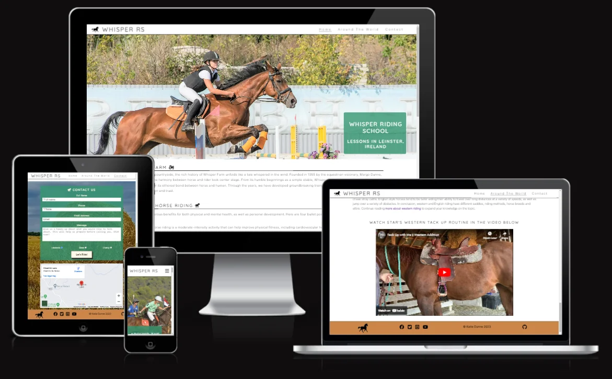

# Whisper Riding School

(Developer: Katie Dunne)

## Live website

Link to live website: [Whisper Riding School](https://ksdunne.github.io/whisper_riding_school/)

## Purpose of the project

Whisper Riding School is a fictitious business. Here is a 3-page, responsive website, built using only HTML and CSS for that business. This website is aimed at people that are interested in trying horse riding as a hobby, in the Leinster area of Ireland. The owner of 'Whisper Riding School' seeks to provide value to these people via horse riding education and in turn convert these interested people into customers of 'Whisper Riding School'. This website provides the user with history about the farm, information about the benefits of horse riding, provides education on horse riding disaplines from around the world and encourages the user to use a contact form to get further information on lessons, safe riding gear, boarding and livery.

## Table of Contents

## Project goals

The goals of this website are as follows:

### Business goals

- Provide the user with information about the benefits of horse riding
- Increase awareness of the services that Whisper Riding School provides
- Educate the customer with snippets of horse riding disaplines from around the world
- Educate the customer on safe and functional riding gear
- Create an easy path for customers to find our contact details and to find our physical site in Carlow

### User goals

- Learn about the benefits of horse riding as a hobby
- Once the user knows about the benefits of horse riding then would then like to find a service that offers horse riding lessons in the Leinster region of Ireland
- Learn about a range of horse riding disaplines from around the world
- Familiarise themselves with safe and functional riding gear
- Find contact information for the farm so they can arrange a time and date for their riding lessons and easily find the physical site using a map

## User experience (UX)

### Target audience

- Adult customers that are new to horse riding that would like to explore the benefits of physical exericise paired with a connection to animals
- Parents of children that would like to explore horse riding as a new hobby
- Experienced riders that would like to book lessons or use the site to widen their knowledge about riding disaplines from around the world
- Perspective lesson customers that would like to know what gear to bring with them, that is safe and functional? As this is a FAQ in horse riding

### User requirements and expectations

- A visually appealing and intuitively structured website that works well and is easy to read on all screen sizes
- An intuitive navigation system wheather using a mobile, tablet or monitor
- Ability to quickly find relevant information on the business and its services
- Easy ways to contact the business and find our physical site using a map
- An ability to learn about horse riding disaplines from around the world and about safe riding gear
- Access to a newsletter sign up form
- An accessible website for all users
- A website that loads quickly on all devices and connections

## User stories

### 1. First time visitor goals

- As a first time visitor, I want to understand purpose of this website and to easily navigate through it
- As a first time visitor, I want to see the benefits of horse riding, so I can tell whether I would like to do it or not
- As a first time visitor, I want to be able to see if the physical site is near where I live and find out how to contact them, e.g. a map, social links and contact information

### 2. Returning visitor goals

- As a returning visitor, I want to contact Whisper Riding School to book a lesson
- As a returning visitor, I want to be able to learn about safe riding gear that I should bring with me to my lesson
- As a returning visitor, I want to check the map again, however this time it is to plan my route for the day I will arrive at my lesson

### 3. Frequent user goals

- As a frequent user, I want to broden my knowlegde of horse riding disaplines from around the world
- As a frequent user, I want to sign up for a newsletter
- As a frequent user, I want to check to see if there is any new updates on the website

## Features

### Logo and Navigation bar

A responsive navigation bar is in place. Concentrating on 'mobile first' design, the navigation bar incorporates a clickable burger icon with a drop down menu on mobile. When moving to tablet and monitor size the burger disappears and a traditional navigation bar appears with options to navigate to pages; 'Home', 'Around the World' or 'Contact'. There is a clickable horse logo for monitor sizes. This design benefits the user as it is intuitive and a common nav bar design. It is inviting to use, because it is easy to navigate.

#### Mobile navigation bar with burger menu

#### Monitor navigation bar with clickable horse logo

### Hero Image

The hero image on the index page was chosen to convey the exact purpose of Whisper Riding School. It is a colourful image of a girl jumping a fence on horseback in a sand arena. This is a typical activity you would find at a riding school in Ireland.

#### Mobile hero image on home page

#### Monitor hero image on home page

### Cover text and tagline

The responsive cover text over the hero image states the name of the business and the tagline conveys that we offer lessons. Lessons are what the site user is most likely looking for when they visit this website.

#### Covertext on mobile

#### Covertext on monitor

### About

Gives a romantic history of the farm.

### Benefits of Horse Riding

### A fixed background image

The fixed background image is of a farm landscape. This is a nice visual that is fun to scroll to break up the large about of text that is on the index page.

### What We Offer?

States the four main services that Whisper Riding School offer through the website and the business. These are; 1. 'lessons', 2. 'education' of diverse horse riding disaplines, 3. 'advice on gear' and 4. 'boarding and livery'.

### Around the World

'Around the World' is the second page of this website and it offers the user 4 educational snippets. The user can learn about riding disaplines from around the world Photos of dressage, polo, horse ball and western riding can be seen here with short explainations of each.

### Contact Us

A form with 4 input boxes and a submit button. Two of the fields are required. The required fields are 'Name' and 'Phone number'. Optional fields are email and a message. There is placeholder text in each field of the form.

### Map

Google maps feature

### Footer

Which displays the business adress and social media links.

## Future features

### Live weather forecast

This is a feature on some similar websites that I saw when doing research for this project.

### A page dedicated to gear

This is another popular page on horse riding websites.

### A masonry photo gallery

### Copywrite in the footer

## Design

### Design Choices

I was very loosely inspired by the colors, layout, services and features of the [Carrickmines Equestrian Center] (https://www.carrickminesequestrian.ie/) website.This arised from my research of other horse riding school websites. I wanted to find one with intuitive layout and navigation that fit my desired content and that was also responsive.

The hero image for Whisper Riding School was chosen to convey the exact main service of the business. It is both eye-catching and informational.

### Typography

Google Fonts were used to import Inter and Quicksand fonts into styles.css. A generic sans-serif font was chosen as a back-up font. These were chosen as they are easy to read and are common to modern website design.

### Color

Since this business offers outdoor services such as horse riding lessons I chose earthy colours. Colors were adapted from palettes generated using [Venngage's Accessible color palette generator](https://venngage.com/tools/accessible-color-palette-generator).

Primary Colors - White / Green

Secondary Colors - Orange / Mustard / Blue

- #c9ac3b, mustard
- #88a542, a green
- #5b9c69, a green
- #359672, a green
- #38989c, bluish
- #CC864A, orange

## Wireframes

### Index Page Wireframes

## Technology

## Testing

### Code validation

### Test cases / user story based

### Fixed bugs

### Supported screens and browsers

## Deployment

### How this site was deployed

- In the GitHub repository, go to the Settings tab, then choose Pages from the left hand menu
- Make sure that source is set to 'Deploy from Branch'
- Main branch needs to be selected and folder should be set to root
- Under branch, click save
- Revisit the code tab and wait a few minutes for the build to finish, then refresh your repository
- There will be an option to click on 'github-pages', on the right hand side, in the environments section
- Click on 'view deployment' to see the live site.

  The live link can be found here - [Whisper Riding School](https://ksdunne.github.io/whisper_riding_school/)

## Credits
